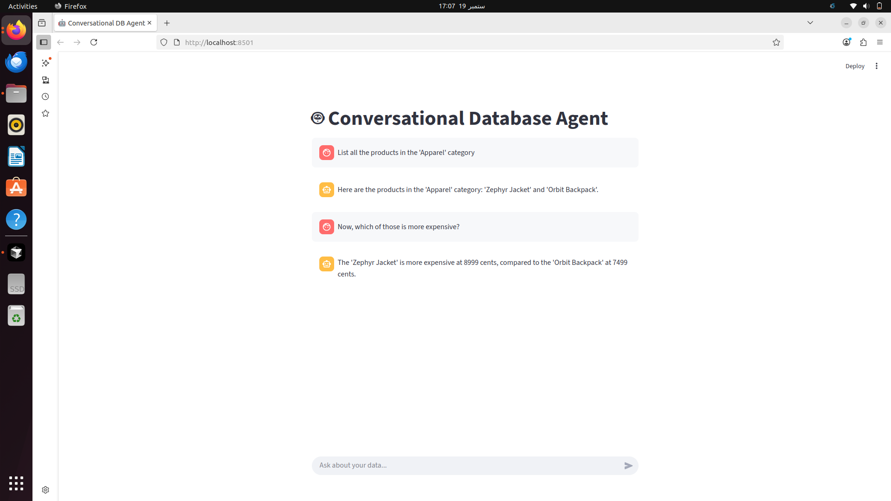

# 🤖 Conversational SQL Database Agent

[](https://www.python.org/)
[](https://streamlit.io)
[](https://www.langchain.com/)
[](https://opensource.org/licenses/MIT)

This project is an intelligent, conversational AI agent that empowers you to chat with your SQL database using natural language. Forget writing complex SQL queries—just ask questions and get answers. The agent features conversational memory, allowing it to understand follow-up questions and provide context-aware responses.

---

### 🎥 Live Demo

This screenshot demonstrates the agent's core conversational memory feature, allowing it to understand and answer a follow-up question.

<p align="center">
  
</p>

---

### ✨ Key Features

*   **Natural Language to SQL:** Translates plain English questions into precise SQL queries.
*   **True Conversational Memory:** Remembers the context of the conversation to answer follow-up questions accurately.
*   **Safety First Guardrails:** Built with a read-only system prompt to prevent any destructive database operations (`DELETE`, `UPDATE`, `DROP`, etc.).
*   **Schema Aware:** Intelligently inspects the database schema to write correct and relevant queries.
*   **User-Friendly Interface:** A clean and intuitive chat interface powered by Streamlit.

---

### 🛠️ Tech Stack

*   **Backend:** Python
*   **AI Framework:** LangChain
*   **LLM:** Google Gemini Pro
*   **UI Framework:** Streamlit
*   **Database:** SQLite

---

### 🚀 Quick Start Guide

Follow these steps to get the project running on your local machine.

#### 1. Prerequisites

*   Python 3.10 or higher installed.
*   A Google Gemini API Key. You can get one from [Google AI Studio](https://aistudio.google.com/app/apikey).

#### 2. Setup

First, clone the repository and navigate into the project directory.

```bash
git clone https://github.com/skyline-GTRr32/SQL-Database-Agent.git
cd SQL-Database-Agent
```

#### 3. Environment and Dependencies

Create and activate a virtual environment, then install the required packages.

```bash
# Create the virtual environment
python3 -m venv venv

# Activate it
# On macOS/Linux:
source venv/bin/activate
# On Windows:
.\venv\Scripts\activate

# Install the dependencies
pip install -r requirements.txt
```

#### 4. Configuration

Create a `.env` file in the root directory to store your API key securely.

```
# .env
GOOGLE_API_KEY="your_actual_google_api_key_here"
```
> **Security Note:** The `.env` file is listed in `.gitignore` to ensure your secret key is never committed to the repository.

#### 5. Database Setup

The project includes a `schema.sql` file to create and populate the SQLite database. Run this command from your terminal:

```bash
# This command creates 'sales.db' and populates it with sample data.
sqlite3 sales.db < schema.sql
```

#### 6. Run the Application

You're all set! Launch the Streamlit application.

```bash
streamlit run main.py
```
The application will open automatically in your web browser.

---

### 💬 Example Conversation

Here is a real example demonstrating the agent's conversational memory:

> **You:**
> `List all the products in the 'Apparel' category`

> **🤖 Agent:**
> `Here are the products in the 'Appearel' category: 'Zephyr Jacket' and 'Orbit Backpack'.`

> **You:**
> `Now, which of those is more expensive?`

> **🤖 Agent:**
> `The 'Zephyr Jacket' is more expensive at 8999 cents, compared to the 'Orbit Backpack' at 7499 cents.`

---

### 📄 License

This project is licensed under the MIT License. See the [LICENSE](LICENSE) file for more details.
